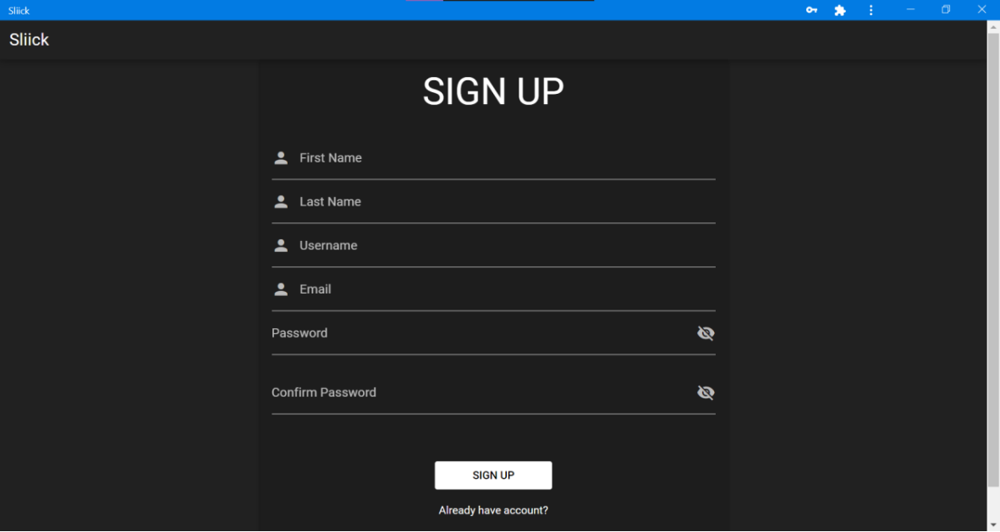
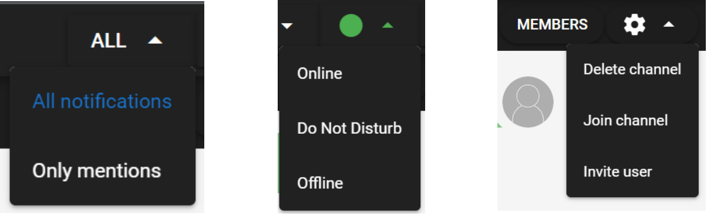

# Progressive IRC (Slack) Style Text Messaging Web Application

This is a solution for a progressive IRC-style text messaging web application. The application allows users to register, log in, and log out. Users can join channels, send messages, and perform various actions related to channel management. The application is built using Vue.js for the frontend and AdonisJS for the backend, including the use of websockets for real-time communication.

## Features

The application implements the following use cases:

1. User Registration, Login, and Logout
   - Users can register with their first name, last name, nickname, and email.
   - Registered users can log in to the application.
   - Users can log out of the application when they are done.

2. Channel Management
   - Users can see a list of channels they are members of.
   - Leaving or being permanently kicked out of a channel removes it from the user's channel list.
   - Inviting a user to a channel highlights and moves the channel to the top of the list.
   - Users can create new channels, leave channels, and cancel channels if they are the administrators.
   - Two types of channels are available: private channels and public channels.
   - The channel administrator is the user who created the channel.
   - Inactive channels (no new messages for more than 30 days) cease to exist.
   - Channel names are unique and can be reused for new channels.

3. Messaging and Commands
   - Users can send messages and commands through the "command line" interface.
   - Messages can be posted in channels where the user is a member.

4. Channel Creation and Membership
   - Users can create communication channels using the `/join channelName [private]` command.
   - Only the channel administrator can add or remove users from private channels using the `/invite nickName` and `/revoke nickName` commands.
   - Any user can join public channels using the `/join channelName` command. If the channel does not exist, it will be created automatically.
   - Members of public channels can invite other users using the `/invite nickName` command.
   - Members of public channels can "kick" other members using the `/kick nickName` command. Permanent bans occur if at least 3 members kick a user. The administrator can kick or restore a user's access using the `/kick nickName` and `/invite nickName` commands.
   - Nicknames and channel names are unique.
   - The channel administrator can close or cancel the channel using the `/quit` command.
   - Users can cancel their membership in a channel using the `/cancel` command. If the channel administrator cancels the channel, it will disappear.

5. User Mentioning
   - Messages in channels can be addressed to specific users using the `@nickname` command.
   - Mentioned messages are highlighted to the mentioned user in the message list.

6. Message History and Notifications
   - Users can view the complete message history in a channel.
   - Users receive notifications for each new message, provided the application is not in the visible state.
   - Notifications contain a part of the message and the sender's information.
   - Users can configure notifications to receive only messages addressed to them.

7. User Status
   - Users can set their status as online, do not disturb (DND), or offline.
   - The user's status is displayed.
   - When in DND status, notifications are disabled.
   - When in offline status, users do not receive messages. Switching to online automatically updates the channels.

8. Channel Member List and Typing Indicator
   - Users can view the list of channel members if they are also members of the channel.
   - In the status bar,

## Screenshots

## Technologies Used

The application is built using the following technologies:

- Frontend: Vue.js
- Backend: AdonisJS

 
